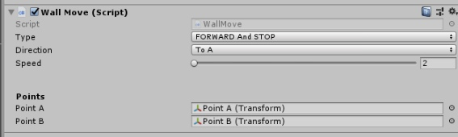

## [AnythingMove.cs](AnythingMove.cs)
What it ? And how it's work
>This is a script for smooth movement of any object in the 3D world (work and for 2D) as flexible as possible for any project.



Points needed for stability move in the need direction.
> It's just Empty Object 
Just check it


* WALL_PREF - it's container for wall and points just empty object
* wall - it's wall with this script
* point A - it's point A XD
* point B - ...... buuuuut you know :) 

## CODE
```C#
 switch (Type)
        {
            case Moveble.FORWARDAndSTOP: transform.position = Vector3.Slerp(transform.position, (Direction == dir.ToA ? PointA : PointB).position, Time.deltaTime / (12 - Speed)); break;
            case Moveble.СYCLE: transform.position = Vector3.Lerp(transform.position, (Direction == dir.ToA ? PointA : PointB).position, Time.deltaTime / (12 - Speed));
                if ((Direction == dir.ToA ? PointA : PointB) && Vector3Int.CeilToInt(transform.position) == Vector3Int.CeilToInt((Direction == dir.ToA ? PointA : PointB).position))
                    if (Direction == dir.ToA) Direction = dir.ToB; else Direction = dir.ToA; break;
        }
```
It's main script logic
One second i formatting it
```C#
switch (Type)
        {
            case Moveble.FORWARDAndSTOP:
                transform.position = Vector3.Slerp(transform.position, (Direction == dir.ToA ? PointA : PointB).position, Time.deltaTime / (12 - Speed));
                break;
            case Moveble.СYCLE:
                transform.position = Vector3.Lerp(transform.position, (Direction == dir.ToA ? PointA : PointB).position, Time.deltaTime / (12 - Speed));
                if ((Direction == dir.ToA ? PointA : PointB) &&
                    Vector3Int.CeilToInt(transform.position) == Vector3Int.CeilToInt((Direction == dir.ToA ? PointA : PointB).position))
                    if (Direction == dir.ToA)
                        Direction = dir.ToB; else Direction = dir.ToA;
                break;
        }
```
Maybe it's help

# Thanks for read it. If you want help me you can correct my English) and File Script
